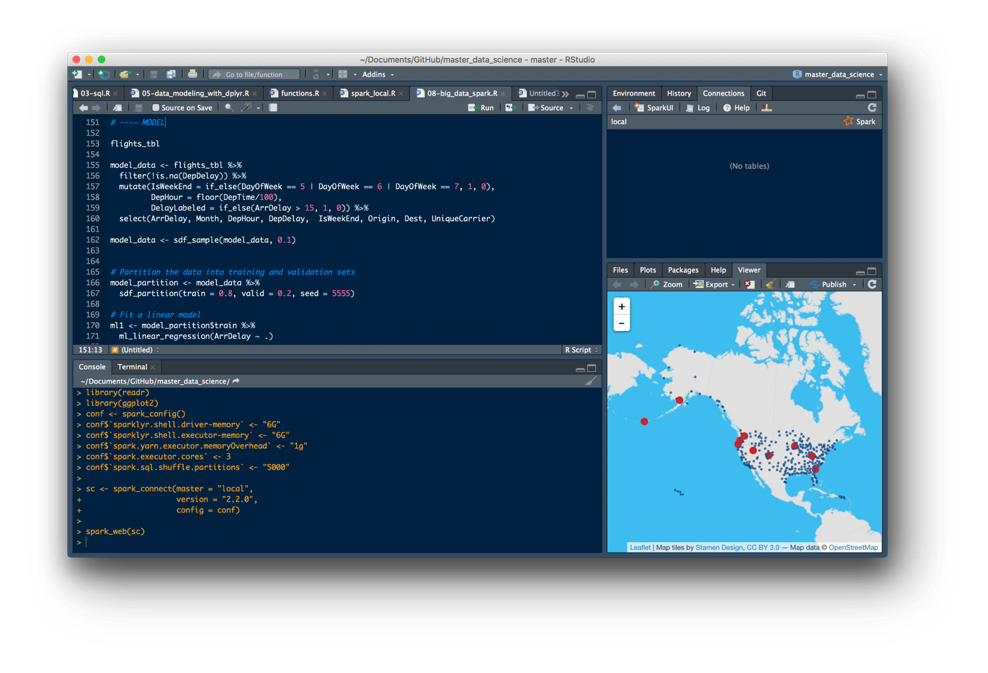
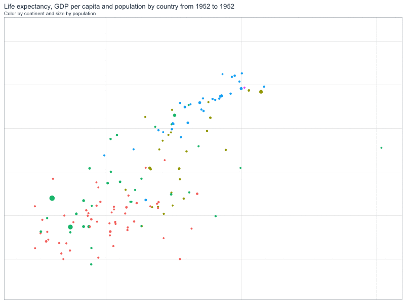

# Data Science Class
Accompanying code repository for my teaching Data Science classes.

## Agenda

1. Getting the data [`01-get_data.R`](01-get_data.R)
2. Importing data into R [`02-read_data.R`](02-read_data.R)
3. SQL with R [`03-sql.R`](03-sql.R)
4. Data wrangling using dplyr [`04-data_wrangling_with_dplyr.R`](04-data_wrangling_with_dplyr.R)
5. Modeling data with dplyr and sql [`05-data_modeling_with_dplyr.R`](05-data_modeling_with_dplyr.R)
6. Advanced importing adn exporting data tips [`06-advanced_import_export.R`](06-advanced_import_export.R)
7. Getting data from Google BigQuery [`07-big_data_bigquery.R`](07-big_data_bigquery.R)
8. Data wrangling and modeling with Apache Spark [`08-big_data_spark.R`](08-big_data_spark.R)
9. Time series manipulation, analysis and forecasting [`09-time_series.R`](09-time_series.R)
10. Time series forecasting using machine learning in H2O [`10-time_series_machine_learning_h2o.R`](10-time_series_machine_learning_h2o.R)
11. Introduction to data visualizacion [`11-dataviz_with_ggplot.R`](11-dataviz_with_ggplot.R)
12. Web scraping and text mining  [`12-web_scraping_text_mining.R`](12-web_scraping_text_mining.R)

## Bonus
* Parallel processing [`bonus-multidplyr.R`](bonus-multidplyr.R)
* Modeling flight data [`bonus_modeling_flights.R`](bonus_modeling_flights.R) 

## Datasets
* [Flights data CSVs](http://stat-computing.org/dataexpo/2009/the-data.html) - [Dictionary](https://www.transtats.bts.gov/Fields.asp?Table_ID=236)
* [Flights data BigQuery](https://bigquery.cloud.google.com/table/datascience-open-data:flights.flights)

## Extra materials
* Time series basics (Spanish)  [`intro_series_temporales.md`](intro_series_temporales.md)

*@jrcajide* - [es.linkedin.com/in/jrcajide
](http://es.linkedin.com/in/jrcajide
)