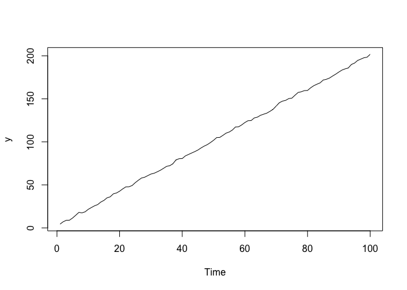
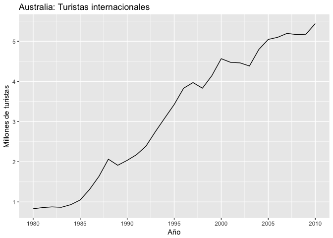
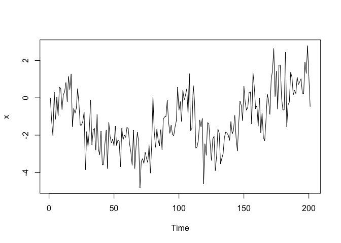
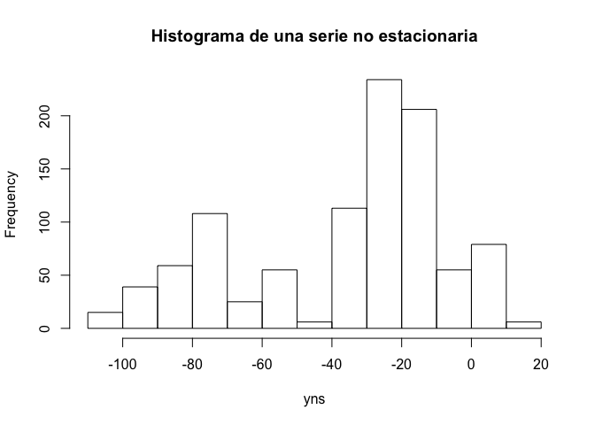
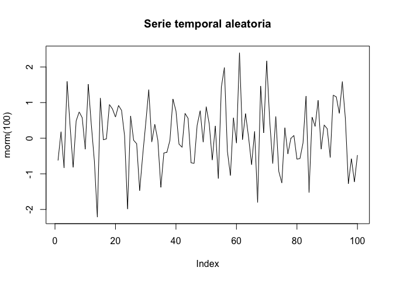

Series temporales
================

Una serie temporal se define como una colección de observaciones (discretas o continuas) de una variable recogidas secuencialmente en el tiempo.

-   El **tiempo** es una elemento natural presente en el momento en el que se genera el dato.
-   **Serie** es la característica fundamental de las series temporales. Quiere decir que una observación presente es influenciada por los valores pasados de la misma (Auto correlación).

Lo modelos de series temporales usarán esta característica para predecir valores futuros.

Ejemplos de series temporales
-----------------------------

-   Índices del tipo de interés
-   Inflacción interanual en España
-   Evolución del número de visitas a un sitio web
-   Habitantes de un país
-   Tasa de natalidad
-   Evolución niveles de CO2 en Madrid

Tipos de series temporales
--------------------------

Una serie temporal puede ser **discreta** o **continua** dependiendo de cómo sean las observaciones.

Series son **determinísticas**: se pueden predecir exactamente los valores ya que éstos se obtienen en función explícita del tiempo.



``` r
summary(lm(y~time(y)))
```

    ## 
    ## Call:
    ## lm(formula = y ~ time(y))
    ## 
    ## Residuals:
    ##      Min       1Q   Median       3Q      Max 
    ## -2.07800 -0.70764 -0.08855  0.69063  2.08977 
    ## 
    ## Coefficients:
    ##             Estimate Std. Error t value Pr(>|t|)    
    ## (Intercept) 2.291474   0.196940   11.63   <2e-16 ***
    ## time(y)     1.987908   0.003386  587.14   <2e-16 ***
    ## ---
    ## Signif. codes:  0 '***' 0.001 '**' 0.01 '*' 0.05 '.' 0.1 ' ' 1
    ## 
    ## Residual standard error: 0.9773 on 98 degrees of freedom
    ## Multiple R-squared:  0.9997, Adjusted R-squared:  0.9997 
    ## F-statistic: 3.447e+05 on 1 and 98 DF,  p-value: < 2.2e-16

``` r
kpss.test(y,null = c('T'))
```

    ## Warning in kpss.test(y, null = c("T")): p-value greater than printed p-
    ## value

    ## 
    ##  KPSS Test for Trend Stationarity
    ## 
    ## data:  y
    ## KPSS Trend = 0.062387, Truncation lag parameter = 2, p-value = 0.1

H0: Tendencia estacionaria (Los datos siguen una tendencia lineal con el tiempo) H1: No estacionaria

0.1 &gt; 0.05 =&gt; No podemos rechazar H0: No hay evidencia de que la serie no sea estacionaria

**Ejemplo**



Series **estocásticas**: el futuro sólo se puede determinar de modo parcial por las observaciones pasadas y no se pueden determinar exactamente, se considera que los futuros valores tienen una **distribución de probabilidad** que está condicionada a los valores pasados.



``` r
kpss.test(x,null = c('T'))
```

    ## Warning in kpss.test(x, null = c("T")): p-value smaller than printed p-
    ## value

    ## 
    ##  KPSS Test for Trend Stationarity
    ## 
    ## data:  x
    ## KPSS Trend = 0.60204, Truncation lag parameter = 3, p-value = 0.01

H0: Tendencia estacionaria (Los datos siguen una tendencia lineal con el tiempo) H1: No estacionaria

0.01 &lt; 0.05 =&gt; Rechazamos H0: La serie no es estacionaria

Objetivos del análisis de series temporales
-------------------------------------------

El principal objetivo es el de elaborar un modelo estadístico que describa la procencia de dicha serie.

-   Descriptivos: La dibujamos y consideramos sus medidas descriptivas básicas. ¿Presentan una tendencia?. ¿Existe estacionalidad?. ¿Hay valores extremos?

-   Predictivos: En ocasiones no sólo se trata de explicar los sucedido sino de ser capaces de predecir el futuro.

Estudio descriptivo
-------------------

Se basa en descomponer una serie temporal en una serie de componentes

-   Tendencia: Movimiento suave de la serie a largo plazo

``` r
data(AirPassengers)
plot(aggregate(AirPassengers,FUN=mean), main="Serie temporal con una tendencia positiva")
```



-   Estacionalidad: Variaciones cada cierto periodo de tiempo (semanal, mensual, etc.). Esta estacionalidad se puede eliminar de la serie temporal para facilitarnos su análisis.

``` r
plot(AirPassengers, main="Serie temporal con una clara estacionalidad")
```


-   Componente aleatoria o ruido (random noise): Son los movimientos de la serie que quedan tras eliminar los demás componenentes. El objetivo es estudiar si existe algún modelo probabilístico que logre explicar este tipo de flutuaciones.

``` r
set.seed(1)
plot(rnorm(100),type="l", main = "Serie temporal aleatoria")
```



> Las dos primeras componentes son determinísticas y la última es estocástica o aletaria.

Al final, una serie temporal *X*<sub>*t*</sub> se define como:

*X*<sub>*t*</sub> = *T*<sub>*t*</sub> + *E*<sub>*t*</sub> + *I*<sub>*t*</sub>

------------------------------------------------------------------------

Dentro de cualquier análisis descriptivo, es básico dibujar la serie.

-   Valores en el eje Y
-   Tiempo en el eje X

A continuación debemos comprobar si la serie es **estacionaria o no estacionaria**.

-   Serie estacionaria: Son series estables. Su media y su varianza son constantes a lo largo del tiempo.

-   Serie no estacionaria: Son inestables, con media y varianza cambiantes a lo largo del tiempo.

> Existen métodos para transformar series no estacionarias en estacionarias.


La serie es estable alrededor de un valor central y la distribución bastante simétrica


 
